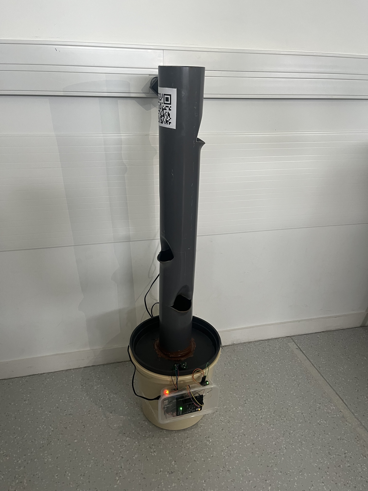
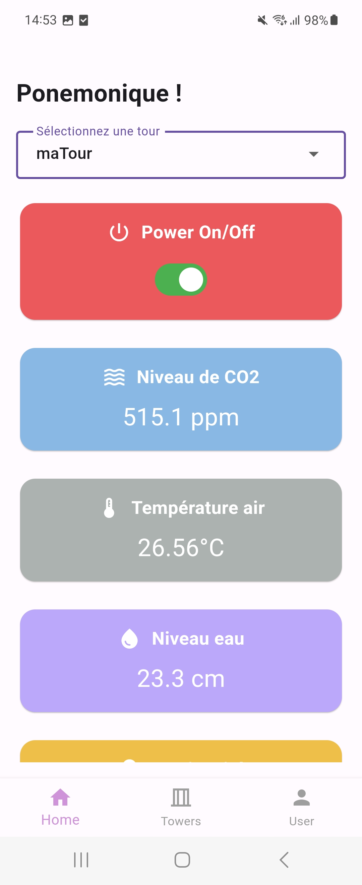

# Tour Hydroponique

Projet de tour hydroponique "ponemonique".

Le projet est pensé pour gérer plusieurs tours depuis une application mobile.

Une tour est composé de capteurs, d'un Raspberry pi, et d'un QR code contenant un identifiant unique.

Depuis l'application mobile, nous avons la possibilité de scanner un QR code :

Lorsque un QR code est scanné, notre utilisateur (précedement crée sur l'application mobile) est ajouté à la liste des utilisateurs ayant accès à la tour.

On retrouve dans l'application mobile :

- Allumage / extinction de la tour à distance depuis l'application
- Visualisation en temps réel des données de la tour : luminosité, CO2, niveau d'eau et température
- Parametrage de la tour
- Parametrage du compte utilisateur

# Architecture

Capteurs -> Raspberry pi <---> Firebase : Firestore & Firebase Authentification <---> Flutter

# Git

- Le dossier "FLUTTER" contient le code de l'application mobile
- le dossier "RASPBERRY" contient le code du Raspberry pi
- le dossier "IMAGES" contient des photos du projet
- le fichier qr_code.png est un QR code contenant un identifiant associé à une tour
- Le projet sur Firebase est sur un compte Firebase privée

# Images

